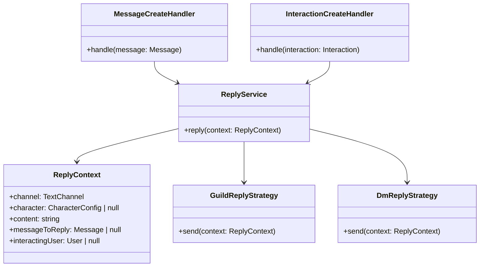

# Architecture Refactor: Reply Service

This document outlines the new architecture for handling bot replies, designed to address the issues of inconsistent formatting, brittle logic, and a lack of a single source of truth.

## The Problem

The core issue is the lack of a unified system for handling bot replies. We have a mix of `message.reply`, `webhook.send`, and `webhook.editMessage` scattered across different handlers, with complex conditional logic to determine which one to use. This has led to several problems:

*   **Inconsistent Formatting**: The assistant's replies are being sent as embeds in guilds, while character replies are sent as webhook messages. This creates a jarring and inconsistent user experience.
*   **Brittle and Complex Logic**: The nested `if` statements make the code difficult to read, understand, and modify. Adding new features or fixing bugs in this environment is a risky proposition.
*   **No Single Source of Truth**: There is no single place to go to understand how bot replies are constructed and sent. This makes it difficult to enforce consistent behavior and to reason about the system as a whole.

## The Proposed Solution

To address these issues, we will implement a new, object-oriented design that introduces a `ReplyService` and a more structured approach to handling different message types.

### High-Level Overview

### Key Components

*   **`ReplyService`**: This will be the new, centralized service for sending all bot replies. It will provide a single, unified interface for sending messages, regardless of the context.
*   **`ReplyContext`**: This will be a simple data object that encapsulates all the information needed to send a reply, including the channel, the character (if any), the content, the message being replied to, and the user who initiated the interaction.
*   **Strategy Pattern**: The `ReplyService` will use a strategy pattern to determine how to send a reply based on the `ReplyContext`. We will have different strategies for sending messages in guilds vs. DMs, and for sending messages as a character vs. the assistant.

### Benefits of this Approach

*   **Improved Code Quality**: The code will be more modular, easier to read, and easier to maintain. The "hell of nested ifs" will be replaced with a clean, object-oriented design.
*   **Consistent User Experience**: All bot replies will be sent through a single, unified system, ensuring consistent formatting and behavior across the board.
*   **Easier to Extend**: The strategy pattern will make it easy to add new message sending strategies in the future without modifying the core logic. For example, if we wanted to add support for a new message format, we would simply create a new strategy class.