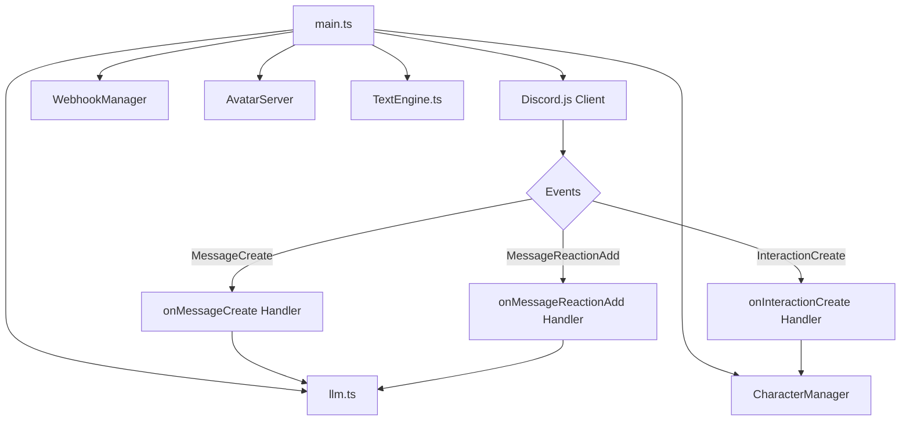
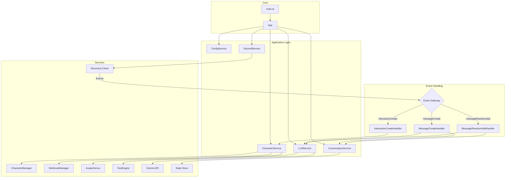

# Refactoring Plan

This document outlines a plan to refactor the application into a more robust, maintainable, and scalable architecture.

### 1. Current Architecture Overview

The current architecture is centered around `main.ts`, which acts as the main orchestrator. It initializes the Discord client and managers, and then registers large, monolithic event handlers for messages, interactions, and reactions.

**Key Issues:**

*   **Lack of Separation of Concerns:** `main.ts` is doing too much, from setup to event handling.
*   **Imperative Style:** The logic is mostly procedural, making it harder to test and reason about.
*   **State Management:** The state is managed in a simple `Map`, which can be fragile.
*   **Readability:** Some functions are very long and complex, making them difficult to understand and maintain.

### 2. Proposed Architecture

I propose a more modular, object-oriented architecture that separates concerns and improves testability. Here is a diagram of the proposed architecture:

**Key Improvements:**

*   **Clear Separation of Concerns:** Each service has a single responsibility.
*   **Dependency Injection:** Services will be initialized and injected into the main `App` class, making the system more modular and testable.
*   **Improved State Management:** A dedicated `ConversationService` will handle conversation state, making it more robust.
*   **Object-Oriented:** The new architecture is more object-oriented, which will make it easier to extend in the future.

### 3. Refactoring Plan

I will perform the refactoring in the following steps:

**Step 1: Create a `ConfigService`**
*   Create a new file `src/services/ConfigService.ts`.
*   This service will be responsible for loading and providing all configuration from environment variables.
*   It will provide default values for optional settings.
*   All calls to `Deno.env.get()` will be replaced with calls to the `ConfigService`.

**Step 2: Create a `DiscordService`**
*   Create a new file `src/services/DiscordService.ts`.
*   This service will encapsulate all interactions with the Discord.js client.
*   It will be responsible for logging in, registering event handlers, and sending messages.
*   The event handlers will be moved to their own dedicated handler classes.

**Step 3: Create a `CharacterService`**
*   Create a new file `src/services/CharacterService.ts`.
*   This service will encapsulate the `CharacterManager`, `WebhookManager`, and `AvatarServer`.
*   It will be responsible for loading, managing, and switching characters.

**Step 4: Create an `LLMService`**
*   Create a new file `src/services/LLMService.ts`.
*   This service will encapsulate the logic from `llm.ts` and `TextEngine.ts`.
*   It will be responsible for generating responses from the language model.

**Step 5: Create a `ConversationService`**
*   Create a new file `src/services/ConversationService.ts`.
*   This service will be responsible for managing the state of conversations.
*   It will replace the `lastBotMessage` map with a more robust state management solution.

**Step 6: Create an `App` Class**
*   Create a new file `src/App.ts`.
*   This class will be the main entry point for the application.
*   It will initialize all the services and start the bot.
*   `main.ts` will be simplified to just create an instance of the `App` class and run it.

### 4. Conclusion

This refactoring will result in a more organized, maintainable, and scalable codebase. It will be easier to add new features, fix bugs, and test the application.